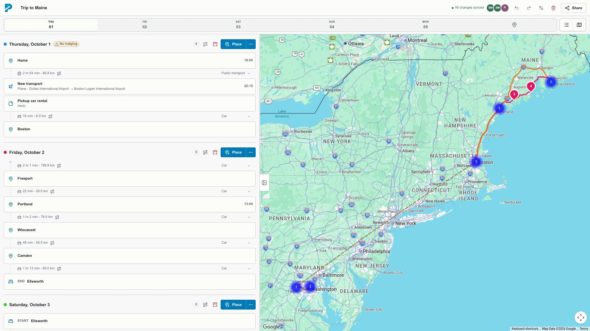

# PaceNotes

PaceNotes is an open source, high-performance web itinerary planner. Several people can edit one fixed-date trip in real time without an account.



## Start locally

1. Install Nix with flakes and direnv.
2. Run `direnv allow`.
3. Copy `.env.example` to `.env`.
4. Add a restricted Google browser key and a Google map ID.
5. Run `docker compose up --build`.
6. Open `http://localhost:3000`.

For application development:

```sh
docker compose up db
pnpm --dir app install
pnpm --dir app db:migrate
pnpm --dir app dev
```

## Checks

```sh
pnpm --dir app typecheck
pnpm --dir app lint
pnpm --dir app test
pnpm --dir app build
pnpm --dir app test:performance
nix flake check
```

Run `pnpm --dir app test:e2e` after the web process and PostgreSQL are ready. Run `pnpm --dir app test:performance` against the production web process on port 3000.

## Deployment

`compose.yaml` runs one web process, a one-shot migration process, and PostgreSQL 18.6. The web process serves HTTP and the `/sync` WebSocket route on one port. The image workflow builds the Nix image for AMD64. A push to `main` publishes `main-SHA` and `latest-unstable`. A `vMAJOR.MINOR.PATCH` tag publishes the version and `latest`, then creates a GitHub release.

The Nix image is available as `.#docker` on Linux. Set these runtime values:

- `DATABASE_URL`
- `RATE_LIMIT_SALT`
- `GOOGLE_MAPS_API_KEY`
- `GOOGLE_MAP_ID`
- `MOTIS_URL` (optional, server-only)
- `MOTIS_TIMEOUT_MS` (optional, server-only)

## Documentation

- [Architecture](docs/architecture.md)
- [Deployment](docs/deployment.md)
- [Routing data and MOTIS](docs/routes.md)
- [Security](docs/security.md)
- [License](LICENSE)
